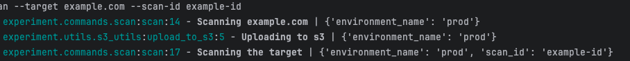

# Loguru Contextual Info experiment

This is a simple experiment to test Loguru and how we can pass contextual information to the logger.

I like using Loguru. You can use strategies like [this](https://betterstack.com/community/guides/logging/loguru/#adding-contextual-data-to-your-logs) to add contextual information to your logs. We are particularly interested in (1) which environment you are running in and (2) the scan ID associated with the command you are running.

My requirements:
1. I want to configure the logger in one place (experiment/bin/logger.py) and be able to import it easily across the rest of my code, without having to pass the logger object around.
2. I want to be able to add contextual information to the logger, such as the environment and the scan ID, without having to pass it around to every function that needs it.

There's some really gnarly code inside `experiment/bin/logger.py` that you can look at, but the main thing to note is that we are using `loguru` to create a logger object and then we are using `contextvars` to create a context that we can use to store the environment and scan ID. This is a bit of a hack, but it works.

I'm mostly storing this for myself to reference in the future, but if you're interested in how to do this, you can look at the code in this repo.

## Running the experiment

Set up prerequisites:

```bash
python3 -m venv ./venv && source venv/bin/activate
pip install -r requirements.txt
```

To run the experiment, execute the following command:

```bash
python3 ./example.py --env prod scan --target example.com --scan-id example-id
```

## Expected Output



